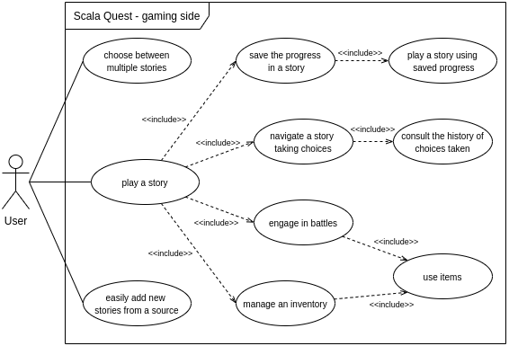
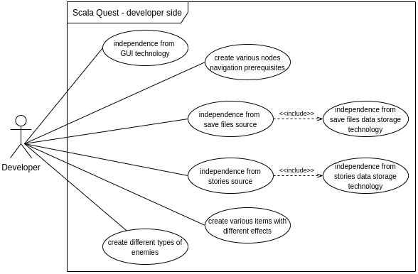

# Requisiti
## Requisiti di business

## Requisiti utente

### User stories

### Casi d'uso

  
  
Diagramma dei casi d'uso - lato gaming

  
  
Diagramma dei casi d'uso - lato developer

## Requisiti funzionali

## Requisiti non funzionali

## Requisiti di implementazione

---